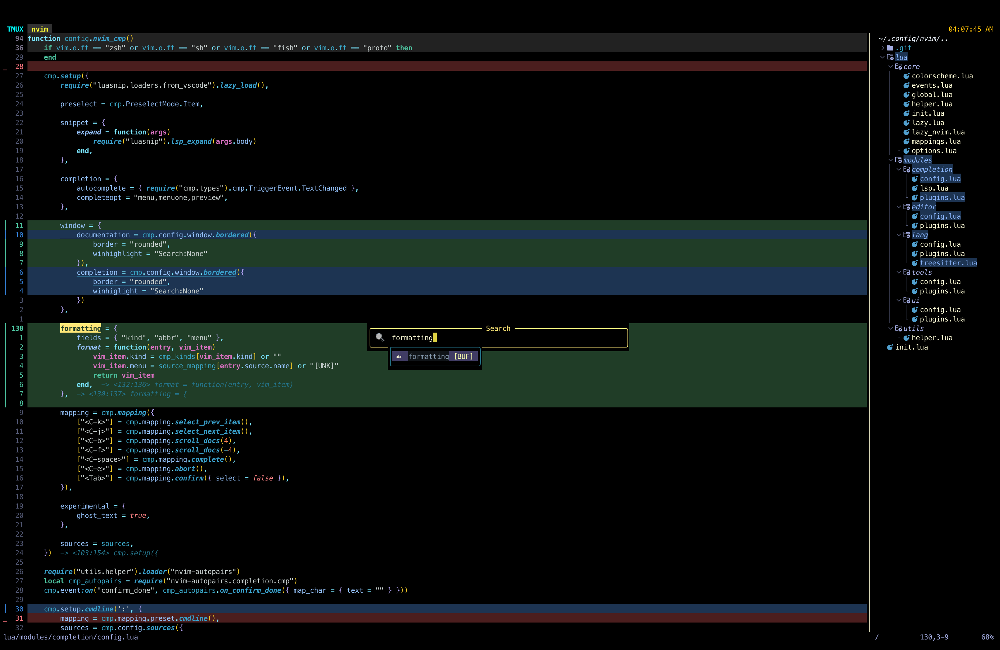

# 💤 Yash's Neovim Setup

A fast and beautiful Neovim configuration built for productivity, aesthetics, and a smooth development experience.

## ✨ Features

- ⚙️ **LSP & Completion** – Fully configured language servers, autocompletion, and inline diagnostics  
- 🧩 **Tree & Git Integration** – `nvim-tree` with Git status highlighting and full-line tinting  
- 🎨 **Modern UI** – Subtle highlights, custom icons, and soft color palettes  
- 🧠 **Code Intelligence** – Treesitter-based syntax highlighting and semantic folding  
- 🪶 **Lightweight** – Lazy-loaded plugins for near-instant startup  

---
